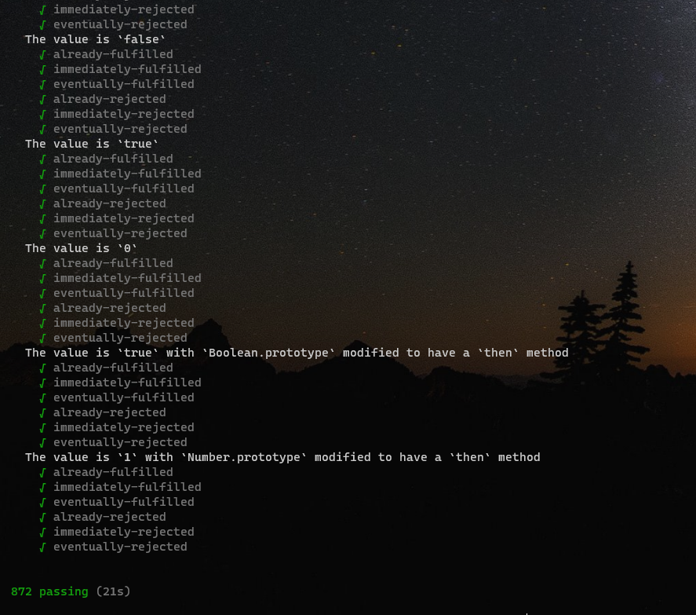

**现在我们从 0 实现一个 A+规范的 Promise，并且实现 A+规范没有描述，但是我们常用的 catch、Promise.all、Promise.race、Promise.resolve、Promise.reject**

首先我们声明一个 Promise 类

```js
class Promise {}
```

一个 Promise 实例包含 3 种状态，分别是 pengding、fulfilled、rejected。  
我们在内部声明一个变量（promiseState），来记录这种状态。  
而且还需要声明：变量 value 来记录 fulfilled 状态的值。变量 reason 来记录 rejected 状态的值。

```js
class Promise {
  #PENDING = "pengding";
  #FULFILLED = "fulfilled";
  #REJECTED = "rejected";
  #promiseState = this.#PENDING;

  #value = undefined;
  #reason = undefined;
}
```

我们使用的时候，给构造函数传入一个函数，例

```js
new Promise((reslove, reject) => {
  reslove("success");
});
```

所以 Promise 的 constructor 应该接收一个函数 executor,并且 executor 接收 reslove 和 reject

```js
class Promise {
  #PENDING = "pengding";
  #FULFILLED = "fulfilled";
  #REJECTED = "rejected";
  #promiseState = this.#PENDING;

  #value = undefined;
  #reason = undefined;
  constructor(executor) {
    const reslove = (value) => {
      // 只有pengding状态才能被修改
      if (this.#promiseState === this.#PENDING) {
        this.#value = value;
        this.#promiseState = this.#FULFILLED;
      }
    };

    const reject = (reason) => {
      if (this.#promiseState === this.#PENDING) {
        this.#reason = reason;
        this.#promiseState = this.#REJECTED;
      }
    };
    // 因为executor函数有可能抛出错误，所以要用try、catch包裹起来。
    try {
      executor(reslove, reject);
    } catch (err) {
      reject(err);
    }
  }
}
```

**then 方法**  
用法：

```js
const p = new Promise((reslove, reject) => {
  reslove("success");
});
p.then(
  (value) => {},
  (reason) => {}
);
```

then 函数接收 2 个参数，第一个是成功的回调（onFulFilled），第二个是失败的回调（onRejected）。

```js
class Promise {
  ...
  then(onFulFilled, onRejected) {
      if (this.#promiseState === this.#FULFILLED) {
        onFulFilled(this.#value)
      }
      if (this.#promiseState === this.#REJECTED) {
        onRejected(this.#reason)
      }
  }
}
```

至此，我们已经完成了最基本的 Promise。贴上第一阶段的完整代码

```js
class Promise {
  #PENDING = "pengding";
  #FULFILLED = "fulfilled";
  #REJECTED = "rejected";
  #promiseState = this.#PENDING;

  #value = undefined;
  #reason = undefined;
  constructor(executor) {
    const reslove = (value) => {
      // 只有pengding状态才能被修改
      if (this.#promiseState === this.#PENDING) {
        this.#value = value;
        this.#promiseState = this.#FULFILLED;
      }
    };

    const reject = (reason) => {
      if (this.#promiseState === this.#PENDING) {
        this.#reason = reason;
        this.#promiseState = this.#REJECTED;
      }
    };
    // 因为executor函数有可能抛出错误，所以要用try、catch包裹起来。
    try {
      executor(reslove, reject);
    } catch (err) {
      reject(err);
    }
  }
  then(onFulFilled, onRejected) {
    if (this.#promiseState === this.#FULFILLED) {
      onFulFilled(this.#value);
    }
    if (this.#promiseState === this.#REJECTED) {
      onRejected(this.#reason);
    }
  }
}

// 此时执行下面的代码，会打印'success'
const p = new Promise((reslove, reject) => {
  reslove("success");
});
p.then(
  (value) => {
    console.log(value);
  },
  (reason) => {}
);
```

**异步，依赖收集与触发**

如果我们将执行代码改成下面这样,会发现'success'不会被打印出来。因为异步执行 reslove。所以执行 zhen 函数的时候，this.#promiseState 状态还没有被改变。

```js
const p = new Promise((reslove, reject) => {
  setTimeout(() => {
    reslove("success");
  }, 1000);
});
p.then(
  (value) => {
    console.log(value);
  },
  (reason) => {}
);
```

因此，我们需要在 then 执行的时候，收集 onFulFilled 和 onRejected，把它们分别放进数组里面（因为后续有链式调用），当 this.#promiseState 改变的时候执行（也就是 resolve 或者 reject 触发的时候执行）

```js
class Promise {
  #PENDING = "pengding";
  #FULFILLED = "fulfilled";
  #REJECTED = "rejected";
  #promiseState = this.#PENDING;

  #value = undefined;
  #reason = undefined;

  #resolveList = [];
  #rejectList = [];

  constructor(executor) {
    const reslove = (value) => {
      // 只有pengding状态才能被修改
      if (this.#promiseState === this.#PENDING) {
        this.#value = value;
        this.#promiseState = this.#FULFILLED;
        // 状态改变了，执行收集的依赖
        this.#resolveList.forEach((onFulFilled) => onFulFilled(this.#value));
      }
    };

    const reject = (reason) => {
      if (this.#promiseState === this.#PENDING) {
        this.#reason = reason;
        this.#promiseState = this.#REJECTED;
        this.#rejectList.forEach((onRejected) => onRejected(this.#reason));
      }
    };
    // 因为executor函数有可能抛出错误，所以要用try、catch包裹起来。
    try {
      executor(reslove, reject);
    } catch (err) {
      reject(err);
    }
  }
  then(onFulFilled, onRejected) {
    if (this.#promiseState === this.#FULFILLED) {
      onFulFilled(this.#value);
    }
    if (this.#promiseState === this.#REJECTED) {
      onRejected(this.#reason);
    }

    onFulFilled &&
      this.#resolveList.push((value) => {
        onFulFilled(value);
      });
    onRejected &&
      this.#rejectList.push((reason) => {
        onRejected(reason);
      });
  }
}
```

至此，我们的 Promise 已经支持异步执行 resolve 和 reject。

**链式调用**

A+规定，每次执行完 then 之后，都会再返回一个 Promise 实例。  
所以我们在 then 方法内再生成一个 Promise 实例。这里我们需要注意，onRejected 的返回值和 onFulFilled 的返回值一样处理。

```js
class Promise{
  ...
  then(onFulFilled, onRejected) {
    const promise = new Promise((resolve, reject) => {
      if (this.#promiseState === this.#FULFILLED) {
        const x = onFulFilled(this.#value);
        resolve(x);
      }
      if (this.#promiseState === this.#REJECTED) {
        const x = onRejected(this.#reason);
        resolve(x);
      }

      onFulFilled && this.#resolveList.push(value => {
        const x = onFulFilled(value);
          resolve(x);
      })
      onRejected && this.#rejectList.push(reason => {
        const x = onRejected(reason);
        resolve(x);
      })
      })
    return promise;
  }
}
```

用法

```js
const p = new Promise((reslove, reject) => {
  setTimeout(() => {
    reslove("success");
  }, 1000);
});
p.then(
  (value) => {
    return value;
  },
  (reason) => {}
).then((value) => {
  console.log(value);
});
```

从上面的例子可以看出，后面的 then 里面的 onFulFilled 接收上一个 then 的 onFulFilled 的返回值。因此我们需要把原来 then 里面的方法，放进新的 Promise 内去执行，得到上一个 onFulFilled 的结果之后，传给新的 Promise 的 onFulFilled。

**A+还规定，如果 then 里面的 onFulFilled 和 onRejected 不是 function，那么忽略 then 里面的参数，把值传到后续的 zhen，onFulFilled 设置为传递 value 的函数就行，而 onRejected 则接收 reason 抛出错误**

至此，第二阶段的 Promise 完整代码。

```js
class Promise {
  #PENDING = "pengding";
  #FULFILLED = "fulfilled";
  #REJECTED = "rejected";
  #promiseState = this.#PENDING;

  #value = undefined;
  #reason = undefined;

  #resolveList = [];
  #rejectList = [];

  constructor(executor) {
    const reslove = (value) => {
      // 只有pengding状态才能被修改
      if (this.#promiseState === this.#PENDING) {
        this.#value = value;
        this.#promiseState = this.#FULFILLED;
        // 状态改变了，执行收集的依赖
        this.#resolveList.forEach((onFulFilled) => onFulFilled(this.#value));
      }
    };

    const reject = (reason) => {
      if (this.#promiseState === this.#PENDING) {
        this.#reason = reason;
        this.#promiseState = this.#REJECTED;
        this.#rejectList.forEach((onRejected) => onRejected(this.#reason));
      }
    };
    // 因为executor函数有可能抛出错误，所以要用try、catch包裹起来。
    try {
      executor(reslove, reject);
    } catch (err) {
      reject(err);
    }
  }
  then(onFulFilled, onRejected) {
    onFulFilled =
      typeof onFulFilled === "function" ? onFulFilled : (value) => value;
    onRejected =
      typeof onRejected === "function"
        ? onRejected
        : (reason) => {
            throw reason;
          };
    const promise = new Promise((resolve, reject) => {
      if (this.#promiseState === this.#FULFILLED) {
        try {
          const x = onFulFilled(this.#value);
          resolve(x);
        } catch (err) {
          reject(err);
        }
      }
      if (this.#promiseState === this.#REJECTED) {
        try {
          const x = onRejected(this.#reason);
          resolve(x);
        } catch (err) {
          reject(err);
        }
      }

      onFulFilled &&
        this.#resolveList.push((value) => {
          try {
            const x = onFulFilled(value);
            resolve(x);
          } catch (err) {
            reject(err);
          }
        });
      onRejected &&
        this.#rejectList.push((reason) => {
          try {
            const x = onRejected(reason);
            resolve(x);
          } catch (err) {
            reject(err);
          }
        });
    });
    return promise;
  }
}
```

根据第二阶段的代码，我们运行下面的例子

```js
const p = new Promise((reslove, reject) => {
  setTimeout(() => {
    reject("failed");
  }, 1000);
});
p.then(
  (value) => {
    console.log("value", value);
    return value;
  },
  (reason) => {
    console.log("reason", reason);
    return 12212;
  }
).then(
  (res) => {
    console.log(res);
  },
  (reason) => {
    console.log("reason", reason);
  }
);

/* 
    打印
    reason failed
    12212
   */
```

**处理特殊的返回值，例如返回值是 Promise 实例**

下面的例子，按照 A+规范，第一个 onFulFilled（onRejected 同理）传递给下面 then 的值应该 resolve(value + "000")。这时我们就要特殊处理 onFulFilled 的返回值，根据不同类型的值，执行不同的方法。因为几个地方都需要处理，所以我们编写公共函数 resolvePromise 统一处理。

```js
const p = new Promise((reslove, reject) => {
  setTimeout(() => {
    reslove("success");
  }, 1000);
});
p.then(
  (value) => {
    console.log("value", value);
    return new Promise((resolve, reject) => {
      resolve(value + "000");
    });
  },
  (reason) => {
    console.log("reason", reason);
  }
).then(
  (res) => {
    console.log(res);
  },
  (reason) => {
    console.log("reason", reason);
  }
);
```

```js
function resolvePromise(x, resolve, reject) {
  // A+规范返回值x只要是object或者function就可视为Promise实例
  if (x !== null && (typeof x === 'function' || typeof x === 'object')) {
    // A+规范x的then方法有可能不存在，所以用try、catch包裹起来。
    try {
      const then = x.then;
      // 不是函数的直接resolve
      if (typeof then === 'function') {
        then.call(
          x,
          value => {
            // resolve的结果依旧是promise，递归解析
            resolvePromise(value, resolve, reject);
          },
          reason => {
            reject(reason);
          }
        )
      } else {
        resolve(x);
      }
    } catch (err) {
      reject(err);
    }
  } else {
    // 其他值直接resolve
    resolve(x);
  }
}

class Promise {
  ...
  then(onFulFilled, onRejected) {
    onFulFilled =
      typeof onFulFilled === "function" ? onFulFilled : (value) => value;
    onRejected =
      typeof onRejected === "function"
        ? onRejected
        : (reason) => {
            throw reason;
          };
    const promise = new Promise((resolve, reject) => {
      if (this.#promiseState === this.#FULFILLED) {
        try {
          const x = onFulFilled(this.#value);
          resolvePromise(x, resolve, reject);
        } catch (err) {
          reject(err);
        }
      }
      if (this.#promiseState === this.#REJECTED) {
        try {
          const x = onRejected(this.#reason);
          resolvePromise(x, resolve, reject);
        } catch (err) {
          reject(err);
        }
      }

      onFulFilled &&
        this.#resolveList.push((value) => {
          try {
            const x = onFulFilled(value);
            resolvePromise(x, resolve, reject);
          } catch (err) {
            reject(err);
          }
        });
      onRejected &&
        this.#rejectList.push((reason) => {
          try {
            const x = onRejected(reason);
            resolvePromise(x, resolve, reject);
          } catch (err) {
            reject(err);
          }
        });
    });
    return promise;
  }
}
```

添加完resolvePromise方法之后，上面的示例代码，运行之后可得到
```js
value success
success000
```

**微任务**

根据浏览器或者node支持的微任务方法，我们实现一个自己的microtask，该函数传入一个function，然后改function就以微任务队列执行。

```js
// 生成微任务函数，默认走setTimeout
let microtask = fn => { setTimeout(() => { fn() }) }
if (queueMicrotask) {
  // node/deno/chrome/firefox支持queueMicrotask
  microtask = queueMicrotask;
} else if (MutationObserver) {
  // 其余浏览器使用MutationObserver
  microtask = (fn) => {
    const node = document.createElement('div');
    const observer = new MutationObserver(function () {
      fn()
    })
    observer.observe(node, {
      childList: true,
    })
    node.innerHTML = 1;
  }
}
```
Promise实现微任务队列

```js
class Promise {
  ...
  then(onFulFilled, onRejected) {

    onFulFilled = typeof onFulFilled === 'function' ? onFulFilled : value => value;
    onRejected = typeof onRejected === 'function' ? onRejected : reason => { throw reason };

    // 生成微任务函数，默认走setTimeout
    let microtask = fn => { setTimeout(() => { fn() }) }
    if (queueMicrotask) {
      // node/deno/chrome/firefox支持queueMicrotask
      microtask = queueMicrotask;
    } else if (MutationObserver) {
      // 其余浏览器使用MutationObserver
      microtask = (fn) => {
        const node = document.createElement('div');
        const observer = new MutationObserver(function () {
          fn()
        })
        observer.observe(node, {
          childList: true,
        })
        node.innerHTML = 1;
      }
    }

    const promise = new Promise((reslove, reject) => {
      if (this.#promiseState === this.#FULFILLED) {
        microtask(() => {
          try {
            const x = onFulFilled(this.#value);
            resolvePromise(x, reslove, reject)
          } catch (err) {
            reject(err);
          }
        })
      }

      if (this.#promiseState === this.#REJECTED) {
        microtask(() => {
          try {
            const x = onRejected(this.#reason);
            resolvePromise(x, reslove, reject)
          } catch (err) {
            reject(err);
          }
        })
      }

      onFulFilled && this.#resolveList.push(value => {
        microtask(() => {
          try {
            const x = onFulFilled(value);
            resolvePromise(x, reslove, reject)
          } catch (err) {
            reject(err);
          }
        })
      });

      onRejected && this.#rejectList.push(reason => {
        microtask(() => {
          try {
            const x = onRejected(reason);
            resolvePromise(x, reslove, reject)
          } catch (err) {
            reject(err);
          }
        })
      });
    })
    return promise;
  }
}
```

实现微任务之后，如果有人编写不规范的代码，如下(1)。第一个onFulFilled里面把p1（自身then返回的promise实例）返回。这样会导致后续的链式调用（then）无法生效。因为resolvePromise中，执行以下代码时(2),this.#promiseState依然时pending，所以无法触发onFulFilled或者onReject。


```js
// 1
const p = new Promise((reslove, reject) => {
  reslove('success');
});

const p1 = p
  .then(
    value => {
      console.log('value', value);
      return p1
    },
    reason => {
      console.log('reason', reason);
    }
  )

  p1.then(
    value => {
      console.log('value', value);
    },
    reason => {
      console.log('reason', reason);
    }
  )

// 2
then.call(
  x,
  value => {
    // resolve的结果依旧是promise，递归解析
    resolvePromise(value, resolve, reject);
  },
  reason => {
    reject(reason);
  }
)
```

基于以上，我们还需要校验，不能在resolve或者reject里面，把自身then的结果返回。于是我们继续改造resolvePromise。增加一个参数promise（then的返回实例）,校验promise 不能等于 x。否则抛出错误。还有一点，为了防止重复引用，我们在resolvePromise内部声明一个变量called，每次执行了resolve或者reject之后，把called设置为true。

至此，完整的Promise代码如下。我们全局安装promises-aplus-tests

```
npm i -g promises-aplus-tests

再执行如下命令，完美通过所有测试用例，符合A+规范。(需暴露Promise)

promises-aplus-tests Promise.js
```
  
```js
class Promise {
    #PENDING = 'pengding';
  #FULFILLED = 'fulfilled';
  #REJECTED = 'rejected';
  #promiseState = this.#PENDING;

  #value = undefined;
  #reason = undefined;

  #resolveList = [];
  #rejectList = [];

  constructor(executor) {

    const reslove = value => {
      // 只有pengding状态才能被修改
      if (this.#promiseState === this.#PENDING) {
        this.#value = value;
        this.#promiseState = this.#FULFILLED;
        // 状态改变了，执行收集的依赖
        this.#resolveList.forEach(onFulFilled => onFulFilled(this.#value))
      }
    }

    const reject = reason => {
      if (this.#promiseState === this.#PENDING) {
        this.#reason = reason;
        this.#promiseState = this.#REJECTED;
        this.#rejectList.forEach(onRejected => onRejected(this.#reason))
      }
    }
    try {
      executor(reslove, reject);
    } catch (err) {
      reject(err);
    }
  }

  then(onFulFilled, onRejected) {

    onFulFilled = typeof onFulFilled === 'function' ? onFulFilled : value => value;
    onRejected = typeof onRejected === 'function' ? onRejected : reason => { throw reason };

    // 生成微任务函数，默认走setTimeout
    let microtask = fn => { setTimeout(() => { fn() }) }
    if (queueMicrotask) {
      // node/deno/chrome/firefox支持queueMicrotask
      microtask = queueMicrotask;
    } else if (MutationObserver) {
      // 其余浏览器使用MutationObserver
      microtask = (fn) => {
        const node = document.createElement('div');
        const observer = new MutationObserver(function () {
          fn()
        })
        observer.observe(node, {
          childList: true,
        })
        node.innerHTML = 1;
      }
    }


    const promise = new Promise((reslove, reject) => {
      if (this.#promiseState === this.#FULFILLED) {
        microtask(() => {
          try {
            const x = onFulFilled(this.#value);
            resolvePromise(promise, x, reslove, reject)
          } catch (err) {
            reject(err);
          }
        })


      }

      if (this.#promiseState === this.#REJECTED) {
        microtask(() => {
          try {
            const x = onRejected(this.#reason);
            resolvePromise(promise, x, reslove, reject)
          } catch (err) {
            reject(err);
          }
        })

      }

      
      onFulFilled && this.#resolveList.push(value => {
        microtask(() => {
          try {
            const x = onFulFilled(value);
            resolvePromise(promise, x, reslove, reject)
          } catch (err) {
            reject(err);
          }
        })
      });

      onRejected && this.#rejectList.push(reason => {
        microtask(() => {
          try {
            const x = onRejected(reason);
            resolvePromise(promise, x, reslove, reject)
          } catch (err) {
            reject(err);
          }
        })

      });

    })
    return promise;
  }
}

function resolvePromise(promise, x, resolve, reject) {
  if (promise === x) {
    return reject(new TypeError('Chaining cycle detected for promise'))
  }
  // 防止多次调用
  let called;
  if (x !== null && (typeof x === 'function' || typeof x === 'object')) {
    try {
      const then = x.then;
      if (typeof then === 'function') {
        then.call(
          x,
          value => {
            if (called) return;
            called = true;
            // resolve的结果依旧是promise，递归解析
            resolvePromise(promise, value, resolve, reject);
          },
          reason => {
            if (called) return;
            called = true;
            reject(reason);
          }
        )
      } else {
        if (called) return;
        called = true;
        resolve(x);
      }
    } catch (err) {
      if (called) return;
      called = true;
      reject(err);
    }
  } else {
    resolve(x);
  }
}
```


**catch**  
catch的本质还是一个then，只是它第一个参数时onReject。这里的this用的很巧妙，因为调用catch的是上一个then返回的Promise实例，所以这里的this指向的也是上一个Promise实例。因此.catch === .then。
```js
class Promise {
  ...
  catch(onRejected) {
    return this.then(undefined, onRejected);
  }
}
```

**finally**  
finally的本质还是一个then，只是它第一个参数时onFulFilled。同理catch
```js
class Promise {
  ...
  finally(onFulFilled) {
    return this.then(onFulFilled, undefined)
  }
}
```

**静态方法reslove和reject**  
本质是返回一个新的Promise，分别执行reslove和reject
```js
class Promise {
  ...
  static reslove(value) {
    return new Promise((resolve) => {
      resolve(value);
    })
  }

  static reject(reason) {
    return new Promise((_, reject) => {
      reject(reason);
    })
  }
}
```


**静态方法all和race**  
```js
class Promise {
  ...
  static all(promiseList = []) {
    return new Promise((resolve, reject) => {
      let count = 0;
      const result = [];
      promiseList.forEach((promise, index) => {
        promise.then(
          value => {
            result[index] = value;
            count += 1;
            if (count === promiseList.length) {
              resolve(result);
            }
          },
          reason => {
            reject(reason)
          }
        )
      })
    })
  }

  static race(promiseList = []) {
    return new Promise((resolve, reject) => {
      promiseList.forEach((promise) => {
        promise.then(
          value => {
            resolve(value);
          },
          reason => {
            reject(reason)
          }
        )
      })
    })
  }
}
```